# Cookieの入手方法
* 手抜き資料

## ログイン(すでにログイン済みの場合はスキップ)
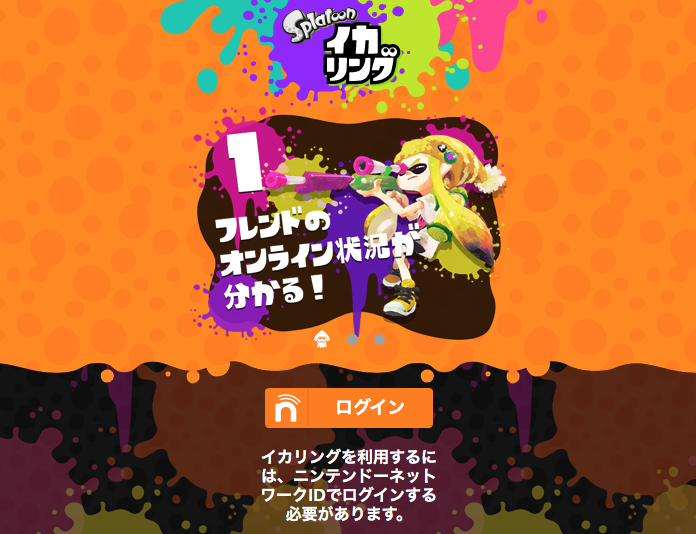
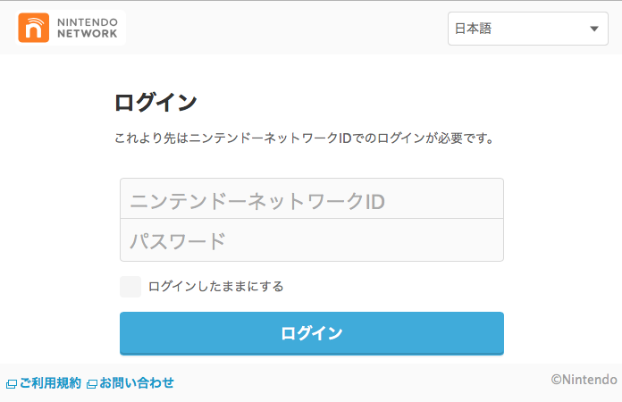

## safari上で操作（ページ上で右クリック）
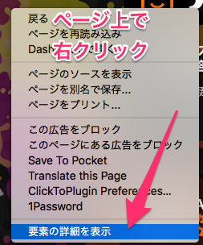

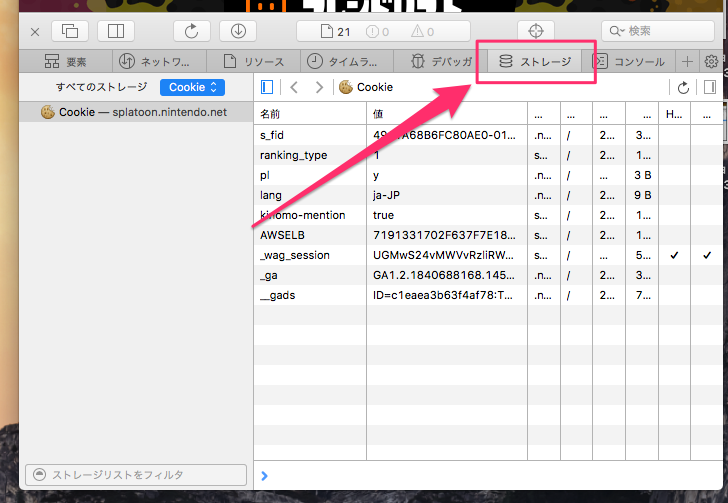
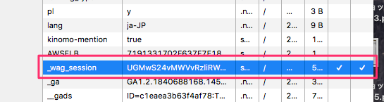
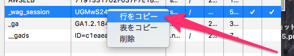

## コピーしたテキストはこんな感じ
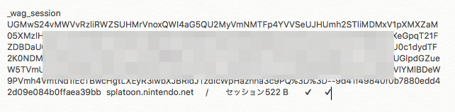

## この部分（`wag_session`）を切り取って使用します
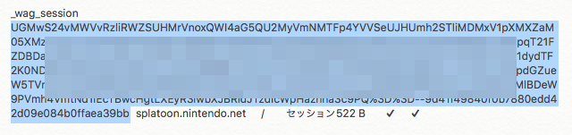
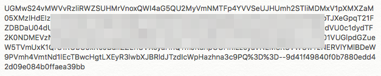

## `lib/login.txt`を編集します
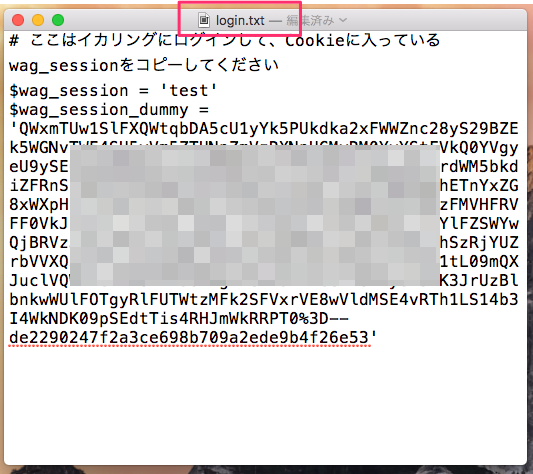

## この部分（`test`）にコピーしてきた（`wag_session`）を貼り付けます
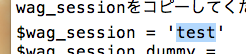

## ここまでできたら上書き保存
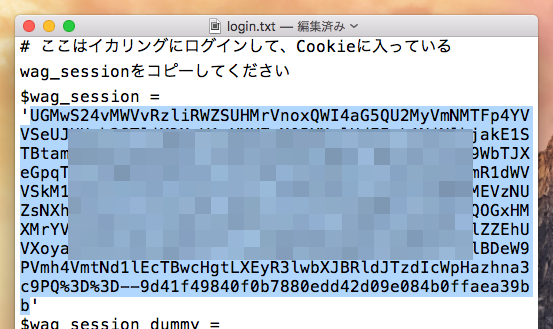

## おしまい