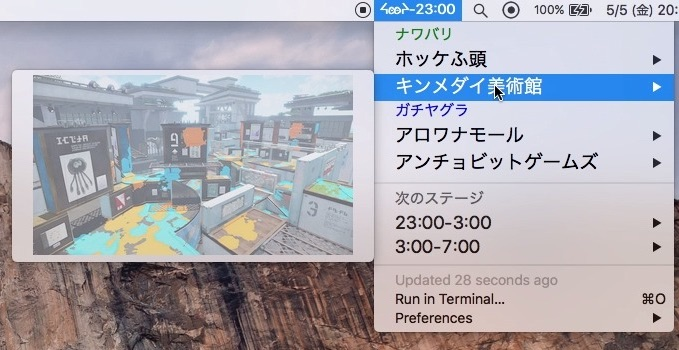

# IkaStalker
* イカフレンド監視用ツール
* [bitbar](https://getbitbar.com)のプラグイン

## Description
* [splapi](https://splapi.fetus.jp)からステージ情報を取得し表示
* [イカリング](https://splatoon.nintendo.net)にて表示できるフレンドのプレイ状態を取得・表示
* 更新間隔はデフォルトで１分

## Installation
1. bitbarを[アプリ配布元](https://github.com/matryer/bitbar/releases/latest)から入手し、インストールする
2. session情報はブラウザでログインして、自分で取得する必要あり
	1. イカリングにログインして、Cookieに入っているwag_sessionをコピー
	2. IkaStalker/lib/login.txtを編集
	3. $wag_sessiond = '〇〇'の〇〇部分にコピーしたwag_sessionを貼り付け（$wag_sessiond_dummyを参考に）
	4. IkaStalker/lib/login.txtを上書き保存
3. bitbarを起動し、_Plugins Directory_としてIkaStalkerフォルダを指定
4. メニューバーに`ᔦꙬᔨ-時刻`の表示が出ていれば起動成功(⚠️表記があれば問題あり)

## Author

[@4juru](https://twitter.com/4juru)

## License

[MIT](http://b4b4r07.mit-license.org)